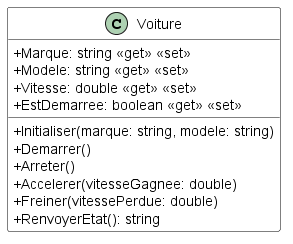

# Module 02 - Introduction

## Exercice 1 - Machine à café

Lisez le code suivant et dessinez le diagramme de classes correspondant.

```csharp

public class MonnayeurCafetiere {
    public decimal MontantCaisse { get; set; }
    public decimal MontantDonneParClient { get; set; }

    public void Initialiser() {
        this.MontantCaisse = 0.0m;
        this.MontantDonneParClient = 0.0m;
    }

    public void RecevoirPiece(decimal p_valeurPiece) {
        this.MontantDonneParClient += p_valeurPiece;
    }

    public void ConfirmerVente(decimal p_montant) {
        this.MontantCaisse += p_montant;
        this.MontantDonneParClient -= p_montant;
    }

    public void AfficherEtat() {
        // Afficher le montant de la caisse
        // ...
    }
}
```

Sur le diagramme, ajoutez la méthode "RendreMonnaie" qui affiche le montant de la monnaie à rendre et qui réinitialise la donnée correspondante dans la classe.

Complétez le code de la classe :

- ajoutez les pré-conditions si nécessaire
- ajoutez la méthode RendreMonnaie

Écrivez les tests unitaires.

Écrivez un sous-programme qui propose (ce n'est pas un menu mais la suite d'opérations):

- d'afficher les choix disponibles à la vente :

```console
   1. Expresso 1$
   2. Jus de chaussettes 1.25$
```

- de choisir le type de café
- de saisir de la monnaie (simuler l'arrivée de pièces), zéro pour arrêter
- si le montant n'est pas valide (retourner à la saisie de nouvelles pièces mais ne plus reposer la question du type de café)
- servir le café demandé
- rendre la monnaie
- retourner au début (Le programme ne s'arrête pas)

## Exercice 2 - Voiture



Créez la classe "Voiture" en suivant le modèle de classes fourni.

La voiture a une vitesse à 0 quand elle est à l'arrêt. La voiture ne peut s'arrêter qu'une fois la vitesse inférieure à 5 km/h et sa vitesse devient nulle.

La voiture ne peut pas accélerer au delà de 230 km / h et ne peut pas avoir une vitesse inférieure à 0 km / h.

La méthode "AfficherEtat" affiche la marque de la voiture, son modèle, son statut d'alimentation et sa vitesse.

La méthode "Initialiser" permet d'initialiser les valeurs de l'objet une fois créé. Cette méthode prend les valeurs de marque et de modèle en paramètres, vous devez les affecter aux bonnes propriétés. Vous devez aussi mettre la valeur de vitesse à 0 et le statut de démarrage à faux.

Écrivez un sous-programme qui permet de :

1. Créer une nouvelle voiture
2. Démarrer la voiture
3. Arreter la voiture
4. Accelerer
5. Freiner
6. Afficher l'état
7. Quitter

Le programme ne doit pas planter aux yeux de l'utilisateur.

Écrivez les tests unitaires des méthodes testables, c'est à dire celles qui n'affiche pas d'information et n'en demande pas à l'utilisateur.

<details>
    <summary>Indice #1</summary>

Commencez par écrire ajouter les propriétés et les méthodes vides. Si une méthode nécessite une valeur de retour, renvoyez une valeur neutre.

</details>
