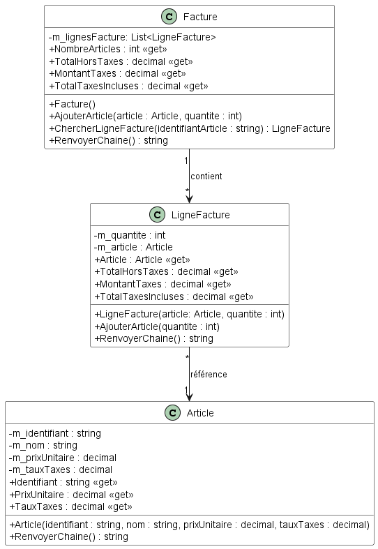
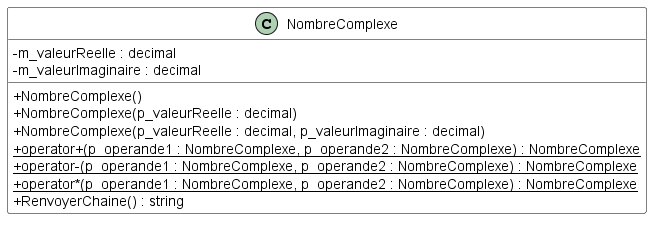

# Module 04 - Constructeur

## Facture

Reprendre le code de l'exercice sur la facture du module 03.

Créez les constructeurs correspondants aux méthodes "Initialiser" et supprimez ces dernières. Modifiez le code et les tests pour adapter les appels.




## Nombres complexes

Un nombre complexe est représenté par deux valeurs a et b représentant respectivement la partie réelle et l'autre la partie imaginaire préfixée par i : a + ib.

Écrivez un programme qui implante les nombres complexes en suivant le diagramme suivant :



La (re)définition d'opérateur en C# est expliquée dans la documentation présente à la page [Operator overloading (C# reference)](https://docs.microsoft.com/en-us/dotnet/csharp/language-reference/operators/operator-overloading).

À titre d'exemple, vous pouvez vous inspirer du code de la page de la documentation ou celui présent sur ce dépot dans ce répertoire.

Cette redéfinition va vous permettre d'écrire du code similaire à :

```CSharp
NombreComplexe nc1 = new NombreComplexe(41.5m);
NombreComplexe nc2 = new NombreComplexe(.5m, 13m);
NombreComplexe ncAdd = nc1 + nc2;

Console.Out.WriteLine(ncAdd.RenvoyerChaine());
```

L'addition de deux nombres complexes suit la formule suivante : (a + ib) + (c + id) = (a + c) + i(b + d).

La soustraction de deux nombres complexes suit la formule suivante : (a + ib) - (c + id) = (a - c) + i(b - d).

La multiplication de deux nombres complexes suit la formule suivante : (a + ib) x (c + id) = (ac – bd) + i (ad  + bc).