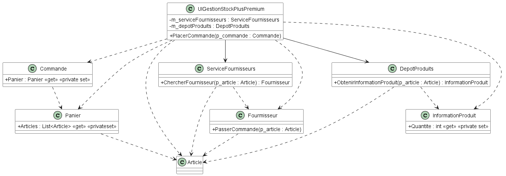

# Module 11 - Démeter, Tell don't ask

## Analyse de code

Soit le code suivant :

```csharp
public class UIGestionStockPlusPremium
{
    public void PlacerCommande(Commande p_commande)
    {
        foreach (var article in p_commande.Panier.Articles)
        {
            Fournisseur fournisseur = null;
            [...]
            int quantite = this.m_depotProduits.ObtenirInformationProduit(article).Quantite;
            if (quantite <= 0) {
                fournisseur = this.m_serviceFournisseurs.ChercherFournisseur(article);
                fournisseur.PasserCommande(article);
            }
            [...]
        }
    }
}
```

À partir du fragment de code précédent, essayez de déduire au mieux le diagramme de classes.

Ajoutez les dépendances entre les classes (Membres, Paramètres, variables locales).
<details>
    <summary>Proposition solution</summary>



</details>

Que pouvez-vous dire de ce code et de ses dépendances ?

## Moteur de jeu

Votre équipe hérite d'un projet de jeu vidéo. Vous devez le reprendre et l'améliorer.

Pour cela, vous devez suivre les étapes suivantes :

- Reprenez le code du projet "POOI_Module11_JeuTir".
- Faites le diagramme de classes du projet.
- Si c'est opportun, modifiez les classes concrètes en classes abstraites ou en interfaces.
- Ajoutez les préconditions manquantes.
- Si des méthodes ne suivent pas les règles vues en cours, modifiez au mieux le code
- Donnez un exemple de programme principal avec un joueur, une sélection d'arme et au moins un tir.
